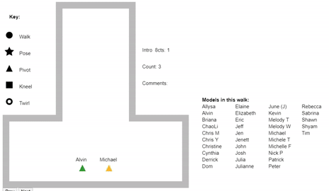

# chinanite-model-simulator
This is a bird's eye view simulator for [ChinaNite](https://www.youtube.com/watch?v=hqvDFgA9IJc), a theatrical fashion show hosted by the Rutgers Chinese Student Organization. Creating, teaching, and remembering walks are difficult; this simulator makes all three easier.
This simulator is intended to create walk guides, not a 100% accurate teaching tool.

Checkout this [demo](https://harryxli.com/walk_simulator_demo.html)!

## How it works
This simulator uses HTML5 canvas to draw each frame of a walk, beat-by-beat. The HTML file loads a JSON file in the same directory (without using a server). When the file opens, it processes the JSON data to calculate at each beat:
1) Where each model will be
2) What section of the song it is
3) If there are any comments

Every time the user presses one of the arrow keys to move forward or back, the canvas is compeletely redrawn, first with the T catwalk, then the models, and finally the song section and comments.

## How to use it
To use this simulator, open "walk_simulaor.html" in a browser. If it loads a valid json file, you can control the movements of each step with your right arrow key to proceed and your left arrow key to go back. In this way, you can step through a song beat-by-beat and see where the models will be at any time.

## How to record a walk
To record a walk, download a tool that can record your screen with audio (for example, Screencastify extension on Chrome). Play the music and manually press the right arrow key to step through the song while recording.

### Why do I have to step through the song manually? Why can't I just hit a "play" button
In order to hit a "play" button and have the simulator automatically step through the walk, you must know the song's exact BPM and then time the start of the song with your simulator. It is difficult to do either. What if the song changes tempo or is slightly off beat at one point? How do you perfectly determine a song's BPM? Small errors can lead to big delays between the music and video.

## JSON files
The HTML file opens json files from the same directory which contain the necessary information for each walk.

### pre_sections
Pre sections allow you to break up the song into parts, so that you know which part you are in. Ex Verse 1, Chorus 1, Bridge, etc.
[number of times this measure repeats, counts per measure, section title]
ex: [4,8,"Verse 1"] corresponds to four 8cts with a label of "Verse 1"
These sections stack so that you don't have to manually set which beats the sections last for, only each section duration

### pre_comments
Pre comments allow you to write comments at different parts of the song.
[comment start beat, comment end beat, comment]
You have to do a little math and guess and check :P

### models
Each model has customizable features. You can give the model a name, starting position, color, and pre moves

### model moves
A model's pre moves are converted into beat-by-beat positions on the canvas. There are a few preset moves you can do:

[number of beats, preset move]
1) up - (negative y) for a set number of beats
2) down - (positive y)
3) left - (negative x)
4) right - (positive x)
5) diag ne - (positive x, negative y)
6) diag nw - (negative x, negative y)
7) diag se - (positive x, positive y)
8) diag sw - (negative x, positive y)

9) custom - for a set number of beats, set a manual change in x and y
[number of beats, dx, dy, move type] (keep in mind that right is positive x, and down is positive y)

10) delay - make the model wait before entering the walk
11) pose - stop at the current position and pose
12) pivot - do a three point turn while walking
13) kneel - kneel at the current position

For pre moves 1-8, you can add a "pivot" option to indicate that the model is pivoting while walking. Ex "down pivot"

## The T
This configuration features the T catwalk. Imagining a 3x3 grid, the T occupies squares (row col):
(1 2)
(2 2)
(3 1)
(3 2)
(3 3)
Each square is four steps wide. Models enter from the bottom middle of the T.
You can change the function "drawT" to draw whatever configuration you like.

## Further application
This lightweight simulator could be used in other applications such as for marching band formations. Feel free to take and adapt this code as you see fit!
MIT License
